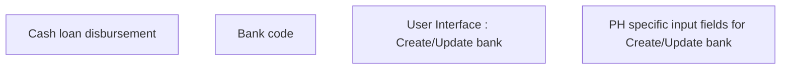

# Create/Update bank - PH specific

- **Diagram Type**: Custom
- **Package**: HomerSelect/BSL/Analysis Model/COMMON for BSL/Bank Management/Bank management/User Interface/PH
- **Diagram ID**: 131859
- **Elements**: 4
- **Connectors**: 0

