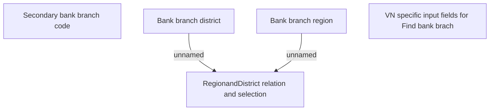

# Find bank branch - VN specific

```mermaid
graph TD
    Secondary_bank_branch_code["Secondary bank branch code"]
    Region_District_relation_and_selection["RegionandDistrict relation and selection"]
    Bank_branch_district["Bank branch district"]
    Bank_branch_region["Bank branch region"]
    VN_specific_input_fields_for_Find_bank_brach["VN specific input fields for Find bank brach"]
    Bank_branch_district -->|unnamed| Region_District_relation_and_selection
    Bank_branch_region -->|unnamed| Region_District_relation_and_selection
```
