# Validation rules

- **Diagram Type**: Custom
- **Package**: HomerSelect/BSL/Analysis Model/COMMON for BSL/Bank Management/Bank management/Validation rules
- **Diagram ID**: 75483
- **Elements**: 15
- **Connectors**: 9

```mermaid
graph TD
    Minimal_search_criteria_bank_branch_ID_specific["Minimal search criteria - bank branch - ID specific"]
    Length_9_characters["Length - 9 characters"]
    Length_11_characters["Length - 11 characters"]
    Numeric_string["Numeric string"]
    Alphanumeric_string["Alphanumeric string"]
    Minimal_search_criteria_for_bank_branch["Minimal search criteria for bank branch"]
    IFSC_Structure_validation["IFSC Structure validation"]
    MICR_Structure_validation["MICR Structure validation"]
    Minimal_search_criteria_Bank_branch["Minimal search criteria - Bank branch"]
    Minimal_search_criteria_for_bank["Minimal search criteria for bank"]
    Minimal_search_criteria_bank["Minimal search criteria - bank"]
    DD_Provider_or_DD_Client_or_DD_provider_type_must_be_selecte["DD Provider or DD Client or DD provider type must be selected"]
    DD_Provider_and_or_DD_Client["DD Provider and/or DD Client"]
    DD_Offset_range["DD Offset range"]
    Allowed_offset_range["Allowed offset range"]
    Allowed_offset_range -->|unnamed| DD_Offset_range
    DD_Provider_or_DD_Client_or_DD_provider_type_must_be_selecte -->|unnamed| DD_Provider_and_or_DD_Client
    Minimal_search_criteria_for_bank -->|unnamed| Minimal_search_criteria_bank
    Minimal_search_criteria_for_bank_branch -->|unnamed| Minimal_search_criteria_Bank_branch
    IFSC_Structure_validation -->|unnamed| Alphanumeric_string
    MICR_Structure_validation -->|unnamed| Numeric_string
    IFSC_Structure_validation -->|unnamed| Length_11_characters
    MICR_Structure_validation -->|unnamed| Length_9_characters
    Minimal_search_criteria_for_bank_branch -->|unnamed| Minimal_search_criteria_bank_branch_ID_specific
```

