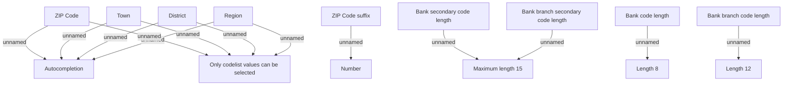

# Validation rules - KZ

```mermaid
graph TD
    Only_codelist_values_can_be_selected["Only codelist values can be selected"]
    Number["Number"]
    Autocompletion["Autocompletion"]
    ZIP_Code["ZIP Code"]
    ZIP_Code_suffix["ZIP Code suffix"]
    Town["Town"]
    District["District"]
    Region["Region"]
    Maximum_length_15["Maximum length 15"]
    Bank_secondary_code_length["Bank secondary code length"]
    Bank_code_length["Bank code length"]
    Bank_branch_secondary_code_length["Bank branch secondary code length"]
    Bank_branch_code_length["Bank branch code length"]
    Length_12["Length 12"]
    Length_8["Length 8"]
    Bank_code_length -->|unnamed| Length_8
    Bank_branch_code_length -->|unnamed| Length_12
    Bank_secondary_code_length -->|unnamed| Maximum_length_15
    Bank_branch_secondary_code_length -->|unnamed| Maximum_length_15
    ZIP_Code -->|unnamed| Autocompletion
    Town -->|unnamed| Autocompletion
    District -->|unnamed| Autocompletion
    Region -->|unnamed| Autocompletion
    ZIP_Code_suffix -->|unnamed| Number
    ZIP_Code -->|unnamed| Only_codelist_values_can_be_selected
    Town -->|unnamed| Only_codelist_values_can_be_selected
    District -->|unnamed| Only_codelist_values_can_be_selected
    Region -->|unnamed| Only_codelist_values_can_be_selected
```
