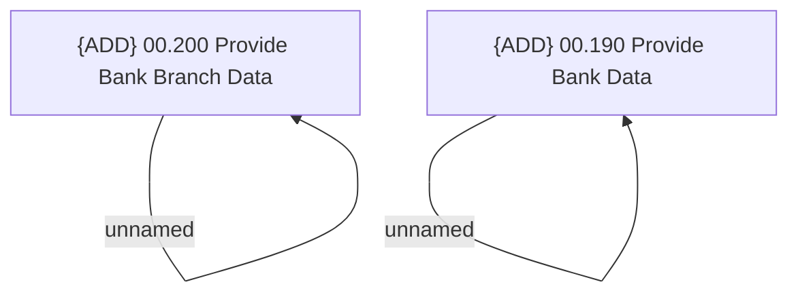

# Access rights

```mermaid
graph TD
    ADD_00_200_Provide_Bank_Branch_Data["{ADD} 00.200 Provide Bank Branch Data"]
    ADD_00_200_Provide_Bank_Branch_Data["{ADD} 00.200 Provide Bank Branch Data"]
    ADD_00_190_Provide_Bank_Data["{ADD} 00.190 Provide Bank Data"]
    ADD_00_190_Provide_Bank_Data["{ADD} 00.190 Provide Bank Data"]
    ADD_00_200_Provide_Bank_Branch_Data -->|unnamed| ADD_00_200_Provide_Bank_Branch_Data
    ADD_00_190_Provide_Bank_Data -->|unnamed| ADD_00_190_Provide_Bank_Data
```
