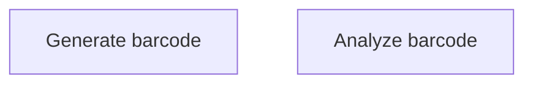

# Business rules

- **Diagram Type**: Custom
- **Package**: HomerSelect/BSL/Analysis Model/COMMON for BSL/BarCodes/Business rules
- **Diagram ID**: 63170
- **Elements**: 2
- **Connectors**: 0

```mermaid
graph TD
    Generate_barcode["Generate barcode"]
    Analyze_barcode["Analyze barcode"]
```
