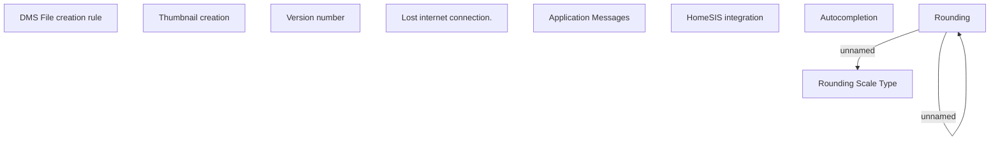

# General business rules

- **Diagram Type**: Custom
- **Package**: HomerSelect/BSL/Analysis Model/COMMON for BSL/COMMON for Common for BSL/Business Rules
- **Diagram ID**: 138028
- **Elements**: 10
- **Connectors**: 2

