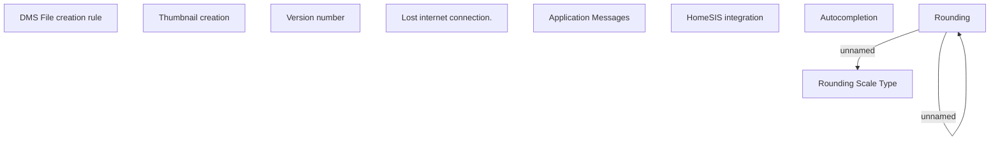

# General business rules

```mermaid
graph TD
    DMS_File_creation_rule["DMS File creation rule"]
    Rounding_Scale_Type["Rounding Scale Type"]
    Thumbnail_creation["Thumbnail creation"]
    Version_number["Version number"]
    Lost_internet_connection["Lost internet connection."]
    Application_Messages["Application Messages"]
    HomeSIS_integration["HomeSIS integration"]
    Autocompletion["Autocompletion"]
    Rounding["Rounding"]
    Rounding["Rounding"]
    Rounding -->|unnamed| Rounding
    Rounding -->|unnamed| Rounding_Scale_Type
```
