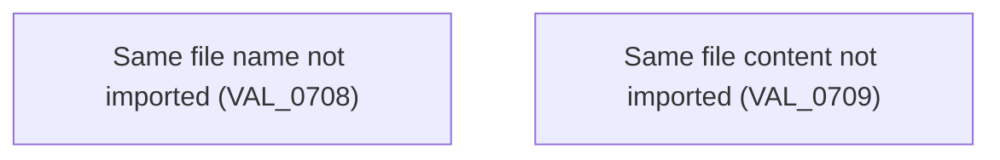

# Import XML files

- **Diagram Type**: Custom
- **Package**: HomerSelect/BSL/Analysis Model/COMMON for BSL/COMMON for Common for BSL/Business Rules
- **Diagram ID**: 138031
- **Elements**: 2
- **Connectors**: 0

