# General rule tasks

- **Diagram Type**: Custom
- **Package**: HomerSelect/BSL/Analysis Model/COMMON for BSL/COMMON for Common for BSL/Validation rules/Common for all variants
- **Diagram ID**: 155184
- **Elements**: 56
- **Connectors**: 22

```mermaid
graph TD
    ADD_Qualification_criteria["{ADD} Qualification criteria"]
    ADD_Qualification_type_and_value_validation["{ADD} Qualification type and value validation"]
    Re_entered_IMEI["Re-entered IMEI"]
    Re_entered_IMEI["Re-entered IMEI"]
    Length_5["Length ‹= 5"]
    Mandatory_if_editable["Mandatory if editable"]
    Mandatory_if_editable["Mandatory if editable"]
    Validation_and_Adjustment_of_Interval_in_Days["Validation and Adjustment of Interval in Days"]
    Length_100["Length ‹= 100"]
    Length_2["Length ‹= 2"]
    Length_35["Length ‹= 35"]
    Length_50["Length ‹= 50"]
    Length_20["Length ‹= 20"]
    Length_30["Length ‹= 30"]
    Length_40["Length ‹= 40"]
    Length_2000["Length ‹= 2000"]
    Length_10["Length ‹= 10"]
    Length_255["Length ‹= 255"]
    Limit_amount_consistence["Limit amount consistence"]
    Unique_value["Unique value"]
    Unique["Unique"]
    Text_character_set["Text character set"]
    Text_character_set["Text character set"]
    Email_format["Email format"]
    Email["Email"]
    Text_with_special_characters["Text with special characters"]
    Text_with_special_characters["Text with special characters"]
    Text_with_special_characters_without_asterisk["Text with special characters without asterisk"]
    Text_with_special_characters_without_asterisk["Text with special characters without asterisk"]
    Numeric["Numeric"]
    Alphanumeric["Alphanumeric"]
    Numeric_string["Numeric string"]
    Alphanumeric_string["Alphanumeric string"]
    Range_limit_numbers["Range limit numbers"]
    Calculation_method_cross_validations_simple["Calculation method cross validations - simple"]
    Calculation_method_composite["Calculation method - composite"]
    Percentage_0_100["Percentage (0-100)"]
    Integer_0["Integer ›= 0"]
    Period["Period"]
    Tax_rate["Tax rate"]
    Mandatory["Mandatory"]
    Calculation_method_Fixed_Percentage["Calculation method Fixed/Percentage"]
    Limits["Limits"]
    Optional["Optional"]
    Optional["Optional"]
    Mandatory["Mandatory"]
    Limit_interval["Limit interval"]
    Limit_amounts["Limit amounts"]
    Limit_number_consistence["Limit number consistence"]
    Rounding_scale["Rounding scale"]
    Financial_amount_0["Financial amount ›= 0"]
    Calculation_method_cross_validations["Calculation method cross validations"]
    Financial_amount_0["Financial amount › 0"]
    Fixed_amount["Fixed amount"]
    Percentage_rate["Percentage rate"]
    MOD_Percentage["{MOD}Percentage"]
    Range_limit_numbers -->|unnamed| Integer_0
    Re_entered_IMEI -->|unnamed| Re_entered_IMEI
    Mandatory_if_editable -->|unnamed| Mandatory_if_editable
    Unique_value -->|unnamed| Unique
    Text_character_set -->|unnamed| Text_character_set
    Email_format -->|unnamed| Email
    Text_with_special_characters -->|unnamed| Text_with_special_characters
    Text_with_special_characters_without_asterisk -->|unnamed| Text_with_special_characters_without_asterisk
    Numeric -->|unnamed| Numeric_string
    ADD_Qualification_criteria -->|unnamed| ADD_Qualification_type_and_value_validation
    Tax_rate -->|unnamed| Percentage_0_100
    Percentage_rate -->|unnamed| MOD_Percentage
    Period -->|unnamed| Integer_0
    Mandatory -->|unnamed| Mandatory
    Re_entered_IMEI -->|unnamed| Mandatory
    Optional -->|unnamed| Optional
    Limit_amounts -->|unnamed| Limit_interval
    Range_limit_numbers -->|unnamed| Limit_interval
    Limit_amounts -->|unnamed| Financial_amount_0
    Calculation_method_cross_validations_simple -->|unnamed| Calculation_method_cross_validations
    Fixed_amount -->|unnamed| Financial_amount_0
    Alphanumeric -->|unnamed| Alphanumeric_string
```

