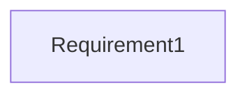

# IN specific validation

- **Diagram Type**: Custom
- **Package**: HomerSelect/BSL/Analysis Model/COMMON for BSL/COMMON for Common for BSL/Validation rules/IN
- **Diagram ID**: 125232
- **Elements**: 1
- **Connectors**: 0

