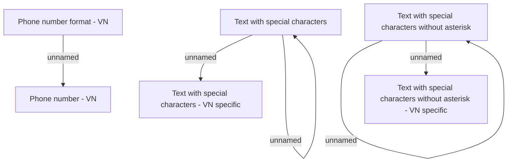

# VN specific validations

```mermaid
graph TD
    Phone_number_VN["Phone number - VN"]
    Phone_number_format_VN["Phone number format - VN"]
    Text_with_special_characters_VN_specific["Text with special characters - VN specific"]
    Text_with_special_characters["Text with special characters"]
    Text_with_special_characters["Text with special characters"]
    Text_with_special_characters_without_asterisk_VN_specific["Text with special characters without asterisk - VN specific"]
    Text_with_special_characters_without_asterisk["Text with special characters without asterisk"]
    Text_with_special_characters_without_asterisk["Text with special characters without asterisk"]
    Phone_number_format_VN -->|unnamed| Phone_number_VN
    Text_with_special_characters -->|unnamed| Text_with_special_characters_VN_specific
    Text_with_special_characters -->|unnamed| Text_with_special_characters
    Text_with_special_characters_without_asterisk -->|unnamed| Text_with_special_characters_without_asterisk
    Text_with_special_characters_without_asterisk -->|unnamed| Text_with_special_characters_without_asterisk_VN_specific
```
