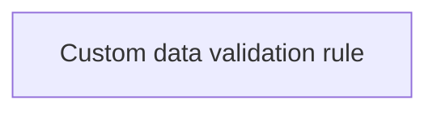

# Validation rules

- **Diagram Type**: Custom
- **Package**: HomerSelect/BSL/Analysis Model/COMMON for BSL/Custom Data Definition/Validation rules
- **Diagram ID**: 79215
- **Elements**: 1
- **Connectors**: 0

