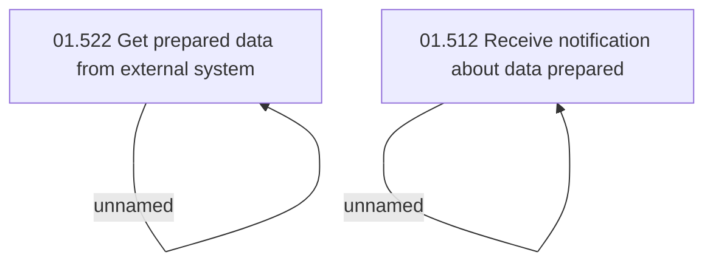

# Access rights

- **Diagram Type**: Custom
- **Package**: HomerSelect/BSL/Analysis Model/COMMON for BSL/Data prepared notification/Access rights
- **Diagram ID**: 74452
- **Elements**: 4
- **Connectors**: 2

