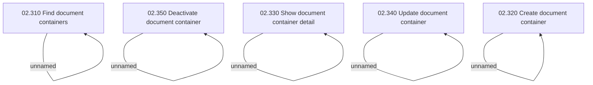

# Access Rights

- **Diagram Type**: Custom
- **Package**: HomerSelect/BSL/Analysis Model/COMMON for BSL/Document/Document Container/Access Rights
- **Diagram ID**: 46611
- **Elements**: 10
- **Connectors**: 5

