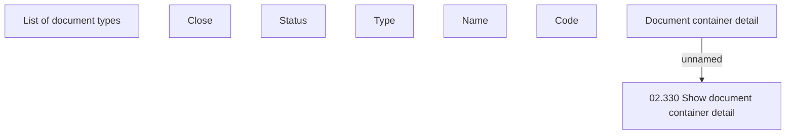

# Document container detail

- **Diagram Type**: Custom
- **Package**: HomerSelect/BSL/Analysis Model/COMMON for BSL/Document/Document Container/User Interface
- **Diagram ID**: 124147
- **Elements**: 8
- **Connectors**: 1

