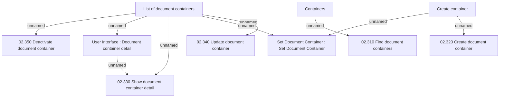

# List of Document Containers

- **Diagram Type**: Custom
- **Package**: HomerSelect/BSL/Analysis Model/COMMON for BSL/Document/Document Container/User Interface
- **Diagram ID**: 124145
- **Elements**: 10
- **Connectors**: 9

