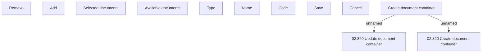

# Set Document Container

```mermaid
graph TD
    Remove["Remove"]
    Add["Add"]
    Selected_documents["Selected documents"]
    Available_documents["Available documents"]
    n_02_320_Create_document_container["02.320 Create document container"]
    Type["Type"]
    n_02_340_Update_document_container["02.340 Update document container"]
    Name["Name"]
    Code["Code"]
    Save["Save"]
    Cancel["Cancel"]
    Create_document_container["Create document container"]
    Create_document_container -->|unnamed| n_02_340_Update_document_container
    Create_document_container -->|unnamed| n_02_320_Create_document_container
```
