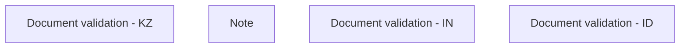

# Validation rules

- **Diagram Type**: Custom
- **Package**: HomerSelect/BSL/Analysis Model/COMMON for BSL/Document/Document Instances/Validation rules
- **Diagram ID**: 62174
- **Elements**: 4
- **Connectors**: 0

