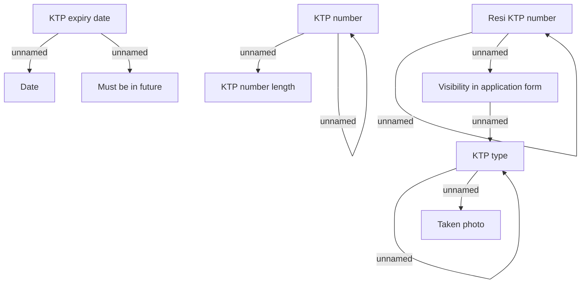

# Document validation - ID

```mermaid
graph TD
    Taken_photo["Taken photo"]
    Visibility_in_application_form["Visibility in application form"]
    Resi_KTP_number["Resi KTP number"]
    Resi_KTP_number["Resi KTP number"]
    KTP_number["KTP number"]
    KTP_type["KTP type"]
    KTP_type["KTP type"]
    KTP_expiry_date["KTP expiry date"]
    KTP_number_length["KTP number length"]
    Must_be_in_future["Must be in future"]
    Date["Date"]
    KTP_number["KTP number"]
    KTP_expiry_date -->|unnamed| Date
    KTP_expiry_date -->|unnamed| Must_be_in_future
    KTP_number -->|unnamed| KTP_number_length
    Visibility_in_application_form -->|unnamed| KTP_type
    KTP_type -->|unnamed| KTP_type
    KTP_number -->|unnamed| KTP_number
    Resi_KTP_number -->|unnamed| Resi_KTP_number
    Resi_KTP_number -->|unnamed| Visibility_in_application_form
    KTP_type -->|unnamed| Taken_photo
```
