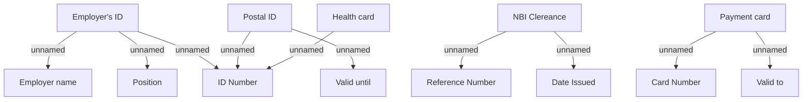

# Generic documents

- **Diagram Type**: Custom
- **Package**: HomerSelect/BSL/Analysis Model/COMMON for BSL/Document/Document Instances/Validation rules/PH/Generic
- **Diagram ID**: 90364
- **Elements**: 15
- **Connectors**: 10

