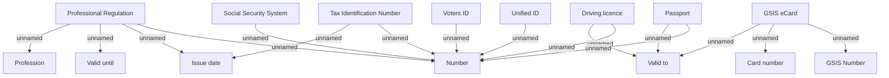

# Identification documents

```mermaid
graph TD
    Valid_to["Valid to"]
    Profession["Profession"]
    Valid_until["Valid until"]
    Issue_date["Issue date"]
    Valid_to["Valid to"]
    Number["Number"]
    GSIS_Number["GSIS Number"]
    Valid_to["Valid to"]
    Number["Number"]
    Card_number["Card number"]
    Professional_Regulation["Professional Regulation"]
    GSIS_eCard["GSIS eCard"]
    Social_Security_System["Social Security System"]
    Number["Number"]
    Driving_licence["Driving licence"]
    Unified_ID["Unified ID"]
    Tax_Identification_Number["Tax Identification Number"]
    Voters_ID["Voters ID"]
    Issue_date["Issue date"]
    Number["Number"]
    Number["Number"]
    Number["Number"]
    Passport["Passport"]
    Number["Number"]
    Social_Security_System -->|unnamed| Number
    Professional_Regulation -->|unnamed| Profession
    Professional_Regulation -->|unnamed| Valid_until
    Professional_Regulation -->|unnamed| Issue_date
    GSIS_eCard -->|unnamed| Valid_to
    Professional_Regulation -->|unnamed| Number
    Passport -->|unnamed| Valid_to
    Driving_licence -->|unnamed| Valid_to
    Voters_ID -->|unnamed| Number
    GSIS_eCard -->|unnamed| Card_number
    Driving_licence -->|unnamed| Number
    Tax_Identification_Number -->|unnamed| Issue_date
    Unified_ID -->|unnamed| Number
    Tax_Identification_Number -->|unnamed| Number
    Passport -->|unnamed| Number
    GSIS_eCard -->|unnamed| GSIS_Number
```
