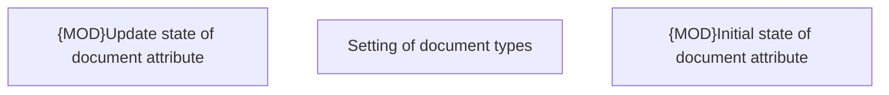

# Business Rules

```mermaid
graph TD
    MOD_Update_state_of_document_attribute["{MOD}Update state of document attribute"]
    Setting_of_document_types["Setting of document types"]
    MOD_Initial_state_of_document_attribute["{MOD}Initial state of document attribute"]
```
