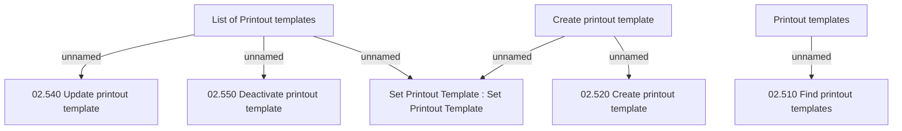

# List of Printout Templates

- **Diagram Type**: Custom
- **Package**: HomerSelect/BSL/Analysis Model/COMMON for BSL/Document/Printout Template/User Interface
- **Diagram ID**: 71466
- **Elements**: 8
- **Connectors**: 6

