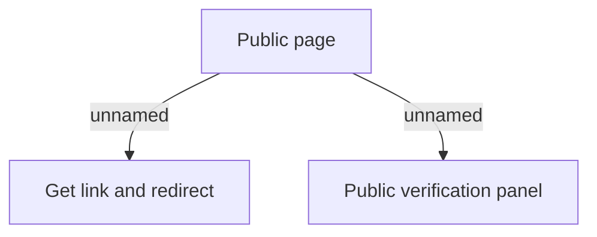

# User interface model

- **Diagram Type**: Custom
- **Package**: HomerSelect/BSL/Analysis Model/COMMON for BSL/Dynamic link/User interface model
- **Diagram ID**: 121025
- **Elements**: 3
- **Connectors**: 2

