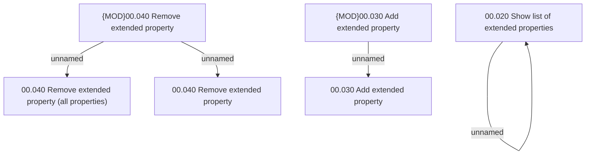

# Access Rights

- **Diagram Type**: Custom
- **Package**: HomerSelect/BSL/Analysis Model/COMMON for BSL/Extended properties/Access Rights
- **Diagram ID**: 123546
- **Elements**: 7
- **Connectors**: 4

