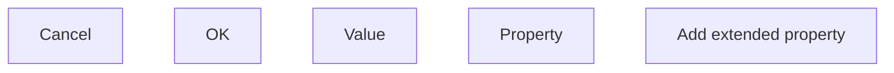

# Add extended property

- **Diagram Type**: Custom
- **Package**: HomerSelect/BSL/Analysis Model/COMMON for BSL/Extended properties/User Interface/Add extended property
- **Diagram ID**: 102927
- **Elements**: 5
- **Connectors**: 0

