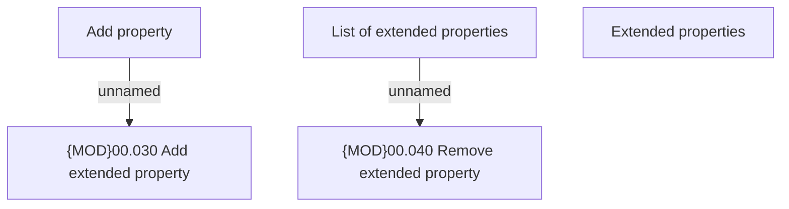

# List of extended properties panel

- **Diagram Type**: Custom
- **Package**: HomerSelect/BSL/Analysis Model/COMMON for BSL/Extended properties/User Interface/List of extended properties
- **Diagram ID**: 107139
- **Elements**: 5
- **Connectors**: 2

