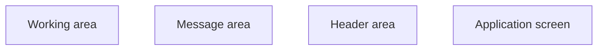

# General parts of the application

- **Diagram Type**: Custom
- **Package**: HomerSelect/BSL/Analysis Model/COMMON for BSL/General parts of the application
- **Diagram ID**: 158003
- **Elements**: 4
- **Connectors**: 0

