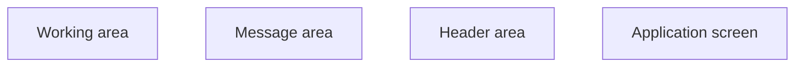

# General parts of the application

```mermaid
graph TD
    Working_area["Working area"]
    Message_area["Message area"]
    Header_area["Header area"]
    Application_screen["Application screen"]
```
