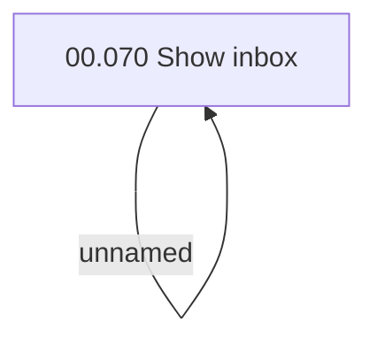

# Access Rights

- **Diagram Type**: Custom
- **Package**: HomerSelect/BSL/Analysis Model/COMMON for BSL/Inbox/Access Rights
- **Diagram ID**: 46443
- **Elements**: 2
- **Connectors**: 1

```mermaid
graph TD
    n_00_070_Show_inbox["00.070 Show inbox"]
    n_00_070_Show_inbox["00.070 Show inbox"]
    n_00_070_Show_inbox -->|unnamed| n_00_070_Show_inbox
```
