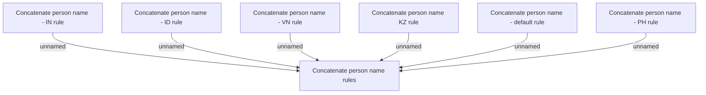

# Business Rules

- **Diagram Type**: Custom
- **Package**: HomerSelect/BSL/Analysis Model/COMMON for BSL/Person/Business Rules
- **Diagram ID**: 82147
- **Elements**: 7
- **Connectors**: 6

```mermaid
graph TD
    Concatenate_person_name_PH_rule["Concatenate person name - PH rule"]
    Concatenate_person_name_default_rule["Concatenate person name - default rule"]
    Concatenate_person_name_KZ_rule["Concatenate person name KZ rule"]
    Concatenate_person_name_VN_rule["Concatenate person name - VN rule"]
    Concatenate_person_name_ID_rule["Concatenate person name - ID rule"]
    Concatenate_person_name_IN_rule["Concatenate person name - IN rule"]
    Concatenate_person_name_rules["Concatenate person name rules"]
    Concatenate_person_name_IN_rule -->|unnamed| Concatenate_person_name_rules
    Concatenate_person_name_ID_rule -->|unnamed| Concatenate_person_name_rules
    Concatenate_person_name_VN_rule -->|unnamed| Concatenate_person_name_rules
    Concatenate_person_name_KZ_rule -->|unnamed| Concatenate_person_name_rules
    Concatenate_person_name_default_rule -->|unnamed| Concatenate_person_name_rules
    Concatenate_person_name_PH_rule -->|unnamed| Concatenate_person_name_rules
```
