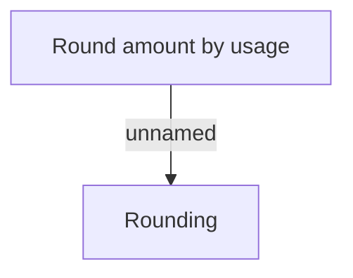

# Business Rules

- **Diagram Type**: Custom
- **Package**: HomerSelect/BSL/Analysis Model/COMMON for BSL/Rounding/Business Rules
- **Diagram ID**: 93621
- **Elements**: 2
- **Connectors**: 1

```mermaid
graph TD
    Round_amount_by_usage["Round amount by usage"]
    Rounding["Rounding"]
    Round_amount_by_usage -->|unnamed| Rounding
```
