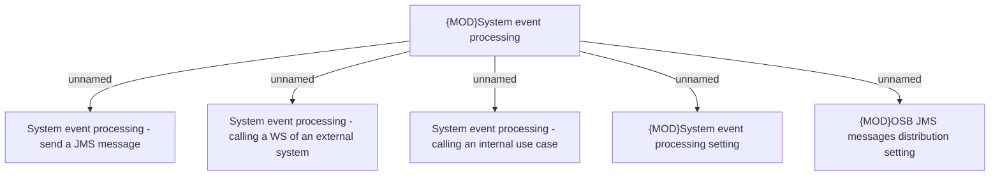

# System events processing setting

```mermaid
graph TD
    MOD_OSB_JMS_messages_distribution_setting["{MOD}OSB JMS messages distribution setting"]
    MOD_System_event_processing_setting["{MOD}System event processing setting"]
    System_event_processing_calling_an_internal_use_case["System event processing - calling an internal use case"]
    System_event_processing_calling_a_WS_of_an_external_system["System event processing - calling a WS of an external system
"]
    System_event_processing_send_a_JMS_message["System event processing - send a JMS message"]
    MOD_System_event_processing["{MOD}System event processing"]
    MOD_System_event_processing -->|unnamed| System_event_processing_send_a_JMS_message
    MOD_System_event_processing -->|unnamed| System_event_processing_calling_a_WS_of_an_external_system
    MOD_System_event_processing -->|unnamed| System_event_processing_calling_an_internal_use_case
    MOD_System_event_processing -->|unnamed| MOD_System_event_processing_setting
    MOD_System_event_processing -->|unnamed| MOD_OSB_JMS_messages_distribution_setting
```
