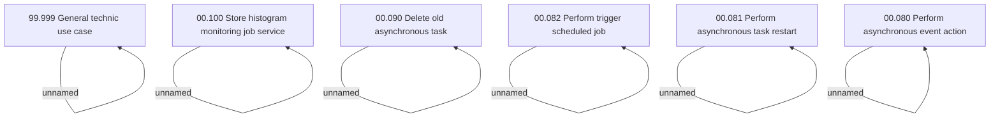

# Access Rights

```mermaid
graph TD
    n_99_999_General_technic_use_case["99.999 General technic use case"]
    n_00_100_Store_histogram_monitoring_job_service["00.100 Store histogram monitoring job service"]
    n_00_090_Delete_old_asynchronous_task["00.090 Delete old asynchronous task"]
    n_00_082_Perform_trigger_scheduled_job["00.082 Perform trigger scheduled job"]
    n_00_081_Perform_asynchronous_task_restart["00.081 Perform asynchronous task restart"]
    n_00_080_Perform_asynchronous_event_action["00.080 Perform asynchronous event action"]
    n_99_999_General_technic_use_case["99.999 General technic use case"]
    n_00_100_Store_histogram_monitoring_job_service["00.100 Store histogram monitoring job service"]
    n_00_090_Delete_old_asynchronous_task["00.090 Delete old asynchronous task"]
    n_00_082_Perform_trigger_scheduled_job["00.082 Perform trigger scheduled job"]
    n_00_081_Perform_asynchronous_task_restart["00.081 Perform asynchronous task restart"]
    n_00_080_Perform_asynchronous_event_action["00.080 Perform asynchronous event action"]
    n_00_080_Perform_asynchronous_event_action -->|unnamed| n_00_080_Perform_asynchronous_event_action
    n_00_081_Perform_asynchronous_task_restart -->|unnamed| n_00_081_Perform_asynchronous_task_restart
    n_00_082_Perform_trigger_scheduled_job -->|unnamed| n_00_082_Perform_trigger_scheduled_job
    n_00_090_Delete_old_asynchronous_task -->|unnamed| n_00_090_Delete_old_asynchronous_task
    n_00_100_Store_histogram_monitoring_job_service -->|unnamed| n_00_100_Store_histogram_monitoring_job_service
    n_99_999_General_technic_use_case -->|unnamed| n_99_999_General_technic_use_case
```
