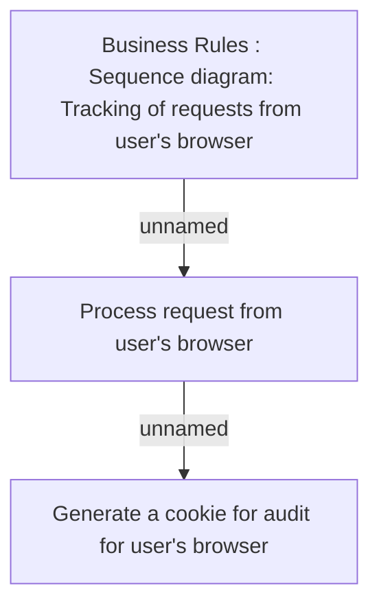

# Business Rules for Tracking of requests from user's browser

```mermaid
graph TD
    Business_Rules_Sequence_diagram_Tracking_of_requests_from_us["Business Rules : Sequence diagram: Tracking of requests from user's browser"]
    Process_request_from_user_s_browser["Process request from user's browser"]
    Generate_a_cookie_for_audit_for_user_s_browser["Generate a cookie for audit for user's browser"]
    Process_request_from_user_s_browser -->|unnamed| Generate_a_cookie_for_audit_for_user_s_browser
    Business_Rules_Sequence_diagram_Tracking_of_requests_from_us -->|unnamed| Process_request_from_user_s_browser
```
