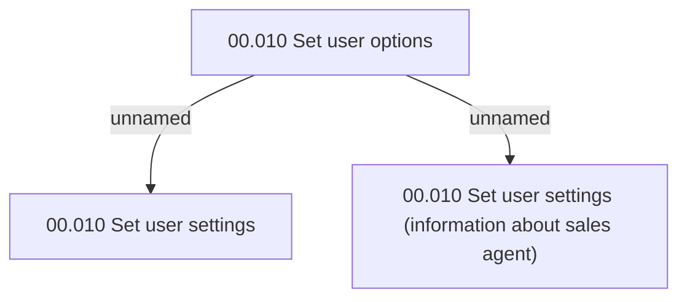

# Access Rights

- **Diagram Type**: Custom
- **Package**: HomerSelect/BSL/Analysis Model/COMMON for BSL/User settings/Access Rights
- **Diagram ID**: 46489
- **Elements**: 3
- **Connectors**: 2

```mermaid
graph TD
    n_00_010_Set_user_settings_information_about_sales_agent["00.010 Set user settings (information about sales agent)"]
    n_00_010_Set_user_settings["00.010 Set user settings"]
    n_00_010_Set_user_options["00.010 Set user options"]
    n_00_010_Set_user_options -->|unnamed| n_00_010_Set_user_settings
    n_00_010_Set_user_options -->|unnamed| n_00_010_Set_user_settings_information_about_sales_agent
```
