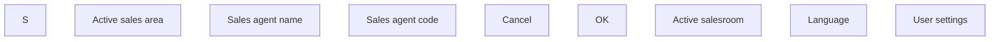

# User setting

- **Diagram Type**: Custom
- **Package**: HomerSelect/BSL/Analysis Model/COMMON for BSL/User settings/User Interface 
- **Diagram ID**: 147642
- **Elements**: 10
- **Connectors**: 0

