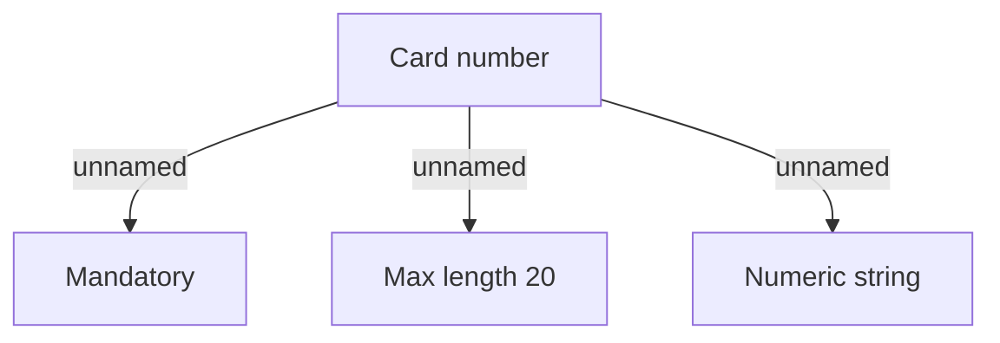

# COMMON for Card management - Validations

```mermaid
graph TD
    Numeric_string["Numeric string"]
    Max_length_20["Max length 20"]
    Card_number["Card number"]
    Mandatory["Mandatory"]
    Card_number -->|unnamed| Mandatory
    Card_number -->|unnamed| Max_length_20
    Card_number -->|unnamed| Numeric_string
```
