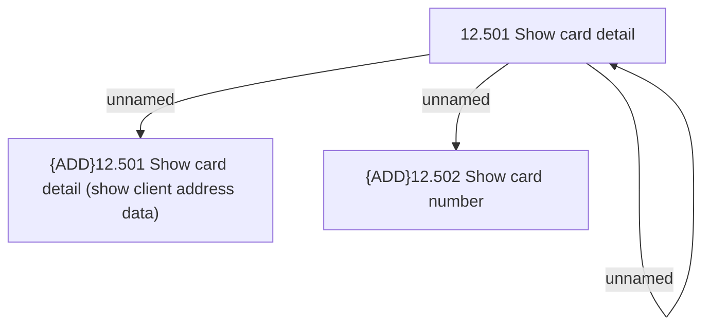

# Card detail - Access right

```mermaid
graph TD
    ADD_12_501_Show_card_detail_show_client_address_data["{ADD}12.501 Show card detail (show client address data)"]
    ADD_12_502_Show_card_number["{ADD}12.502 Show card number"]
    n_12_501_Show_card_detail["12.501 Show card detail"]
    n_12_501_Show_card_detail["12.501 Show card detail"]
    n_12_501_Show_card_detail -->|unnamed| n_12_501_Show_card_detail
    n_12_501_Show_card_detail -->|unnamed| ADD_12_502_Show_card_number
    n_12_501_Show_card_detail -->|unnamed| ADD_12_501_Show_card_detail_show_client_address_data
```
