# Card detail - User interface

- **Diagram Type**: Custom
- **Package**: HomerSelect/BSL/Analysis Model/Card management support/Card detail/User interface
- **Diagram ID**: 136611
- **Elements**: 52
- **Connectors**: 18

```mermaid
graph TD
    Delivery_address["Delivery address"]
    Date_of_status_change["Date of status change"]
    Status["Status"]
    Security_level["Security level"]
    Primary_mobile["Primary mobile"]
    E_commerce["E-commerce"]
    E_commerce_security_level_change["E-commerce security level change"]
    n_12_542_Change_e_commerce_security_level["12.542 Change e-commerce security level"]
    Change_security_level["Change security level"]
    n_12_510_Change_delivery_address["12.510 Change delivery address"]
    Change_delivery_address["Change delivery address"]
    Change_delivery_address["Change delivery address"]
    POS_name["POS name"]
    Delivery_option["Delivery option"]
    Delivery_address_of_personalized_card["Delivery address of personalized card"]
    Emboss_name["Emboss name"]
    Change_of_emboss_name["Change of emboss name"]
    Change_emboss_name["Change emboss name"]
    n_12_509_Change_emboss_name["12.509 Change emboss name"]
    n_12_540_Card_blocking_overview["12.540 Card blocking overview"]
    Client_detail["Client detail"]
    Contract_detail["Contract detail"]
    Show_account_detail["Show account detail"]
    Card_block_unblock["Card block/unblock"]
    MOD_12_539_Internal_PIN_request["{MOD}12.539 Internal PIN request"]
    Client_autentization["Client autentization"]
    Card_replacement["Card replacement"]
    Valid_to["Valid to"]
    Activation_date["Activation date"]
    Renewed_plastic["Renewed plastic"]
    n_12_503_Replace_card["12.503 Replace card"]
    MOD_12_506_Internal_card_activation["{MOD}12.506 Internal card activation"]
    Valid_to["Valid to"]
    Activation_date["Activation date"]
    Primary_plastic["Primary plastic"]
    n_12_501_Show_card_detail["12.501 Show card detail"]
    Block_Unblock["Block/Unblock"]
    Replace["Replace"]
    Request_PIN["Request PIN"]
    Activate["Activate"]
    Tab_Plastics["Tab-Plastics"]
    Card_identifier["Card identifier"]
    Card_status["Card status"]
    Contract_number["Contract number"]
    Date_of_last_PIN_request["Date of last PIN request"]
    Card_type["Card type"]
    Account_number["Account number"]
    Client_full_name["Client full name"]
    Card_number["Card number"]
    Card_detail_header["Card detail header"]
    Tab_History["Tab-History"]
    Card_detail["Card detail"]
    Account_number -->|unnamed| Show_account_detail
    E_commerce_security_level_change -->|unnamed| Change_security_level
    Change_delivery_address -->|unnamed| n_12_510_Change_delivery_address
    Change_delivery_address -->|unnamed| Change_delivery_address
    Change_emboss_name -->|unnamed| Change_of_emboss_name
    Change_emboss_name -->|unnamed| n_12_509_Change_emboss_name
    Block_Unblock -->|unnamed| n_12_540_Card_blocking_overview
    Change_security_level -->|unnamed| n_12_542_Change_e_commerce_security_level
    Contract_number -->|unnamed| Contract_detail
    Card_detail -->|unnamed| n_12_501_Show_card_detail
    Block_Unblock -->|unnamed| Card_block_unblock
    Request_PIN -->|unnamed| MOD_12_539_Internal_PIN_request
    Activate -->|unnamed| Client_autentization
    Request_PIN -->|unnamed| Client_autentization
    Replace -->|unnamed| Card_replacement
    Replace -->|unnamed| n_12_503_Replace_card
    Activate -->|unnamed| MOD_12_506_Internal_card_activation
    Client_full_name -->|unnamed| Client_detail
```

