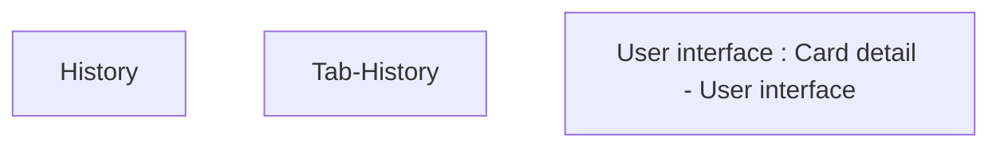

# Tab-History

- **Diagram Type**: Custom
- **Package**: HomerSelect/BSL/Analysis Model/Card management support/Card detail/User interface
- **Diagram ID**: 136609
- **Elements**: 3
- **Connectors**: 0

