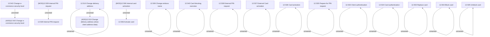

# Card operations - Access right

```mermaid
graph TD
    ADD_12_510_Change_delivery_address_show_client_address_data["{ADD}12.510 Change delivery address (show client address data)"]
    ADD_12_542_Change_e_commerce_security_level["{ADD}12.542 Change e-commerce security level"]
    n_12_542_Change_e_commerce_security_level["12.542 Change e-commerce security level"]
    n_12_510_Change_delivery_address["12.510 Change delivery address"]
    n_12_510_Change_delivery_address["12.510 Change delivery address"]
    n_12_509_Change_emboss_name["12.509 Change emboss name"]
    n_12_509_Change_emboss_name["12.509 Change emboss name"]
    n_12_540_Card_blocking_overview["12.540 Card blocking overview"]
    n_12_540_Card_blocking_overview["12.540 Card blocking overview"]
    n_12_538_External_PIN_request["12.538 External PIN request"]
    n_12_539_Internal_PIN_request["12.539 Internal PIN request"]
    n_12_537_External_Card_activation["12.537 External Card activation"]
    n_12_536_Card_activation["12.536 Card activation"]
    n_12_536_Card_activation["12.536 Card activation"]
    n_12_537_External_Card_activation["12.537 External Card activation"]
    n_12_538_External_PIN_request["12.538 External PIN request"]
    MOD_12_539_Internal_PIN_request["{MOD}12.539 Internal PIN request"]
    n_12_535_Prepare_for_PIN_request["12.535 Prepare for PIN request"]
    n_12_533_Client_authentication["12.533 Client authentication"]
    n_12_534_Card_authentication["12.534 Card authentication"]
    n_12_535_Prepare_for_PIN_request["12.535 Prepare for PIN request"]
    n_12_534_Card_authentication["12.534 Card authentication"]
    n_12_533_Client_authentication["12.533 Client authentication"]
    n_12_506_Activate_card["12.506 Activate card"]
    n_12_503_Replace_card["12.503 Replace card"]
    n_12_504_Block_card["12.504 Block card"]
    n_12_505_Unblock_card["12.505 Unblock card"]
    n_12_505_Unblock_card["12.505 Unblock card"]
    n_12_504_Block_card["12.504 Block card"]
    n_12_503_Replace_card["12.503 Replace card"]
    MOD_12_506_Internal_card_activation["{MOD}12.506 Internal card activation"]
    n_12_533_Client_authentication -->|unnamed| n_12_533_Client_authentication
    n_12_537_External_Card_activation -->|unnamed| n_12_537_External_Card_activation
    n_12_503_Replace_card -->|unnamed| n_12_503_Replace_card
    n_12_510_Change_delivery_address -->|unnamed| n_12_510_Change_delivery_address
    n_12_510_Change_delivery_address -->|unnamed| ADD_12_510_Change_delivery_address_show_client_address_data
    n_12_536_Card_activation -->|unnamed| n_12_536_Card_activation
    n_12_542_Change_e_commerce_security_level -->|unnamed| ADD_12_542_Change_e_commerce_security_level
    n_12_538_External_PIN_request -->|unnamed| n_12_538_External_PIN_request
    n_12_540_Card_blocking_overview -->|unnamed| n_12_540_Card_blocking_overview
    MOD_12_506_Internal_card_activation -->|unnamed| n_12_506_Activate_card
    n_12_535_Prepare_for_PIN_request -->|unnamed| n_12_535_Prepare_for_PIN_request
    n_12_504_Block_card -->|unnamed| n_12_504_Block_card
    n_12_534_Card_authentication -->|unnamed| n_12_534_Card_authentication
    MOD_12_539_Internal_PIN_request -->|unnamed| n_12_539_Internal_PIN_request
    n_12_505_Unblock_card -->|unnamed| n_12_505_Unblock_card
    n_12_509_Change_emboss_name -->|unnamed| n_12_509_Change_emboss_name
```
