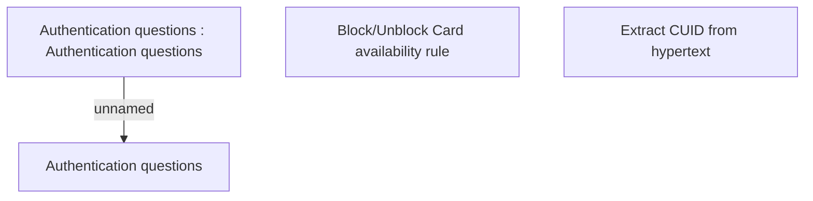

# Business rules

- **Diagram Type**: Custom
- **Package**: HomerSelect/BSL/Analysis Model/Card management support/Card operations/Business rules
- **Diagram ID**: 134532
- **Elements**: 4
- **Connectors**: 1

