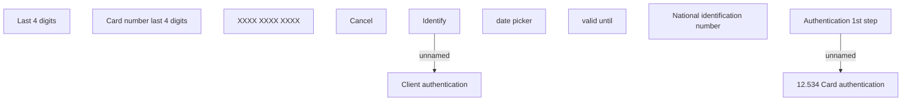

# Card authentication

- **Diagram Type**: Custom
- **Package**: HomerSelect/BSL/Analysis Model/Card management support/Card operations/User interface
- **Diagram ID**: 140755
- **Elements**: 11
- **Connectors**: 2

