# Card block/unblock

- **Diagram Type**: Custom
- **Package**: HomerSelect/BSL/Analysis Model/Card management support/Card operations/User interface
- **Diagram ID**: 140752
- **Elements**: 20
- **Connectors**: 5

```mermaid
graph TD
    Ublock_Confirmation_form["Ublock Confirmation form"]
    Permanent_blocking_reasons["Permanent blocking reasons"]
    channel["channel"]
    channel["channel"]
    User_interface_Card_detail_User_interface["User interface : Card detail - User interface"]
    Temporary_blocking_reasons["Temporary blocking reasons"]
    n_12_504_Block_card["12.504 Block card"]
    n_12_505_Unblock_card["12.505 Unblock card"]
    n_12_540_Card_blocking_overview["12.540 Card blocking overview"]
    Confirm["Confirm"]
    Cancel["Cancel"]
    Note["Note"]
    Note["Note"]
    Permanent_blocking["Permanent blocking"]
    Temporary_blocking["Temporary blocking"]
    Active_blocking_reasons["Active blocking reasons"]
    Permanent_blocking["Permanent blocking"]
    Temporary_blocking["Temporary blocking"]
    Active_blocking_reasons["Active blocking reasons"]
    Block_Unblock_card["Block/Unblock card"]
    Block_Unblock_card -->|unnamed| n_12_540_Card_blocking_overview
    Active_blocking_reasons -->|unnamed| n_12_505_Unblock_card
    Confirm -->|unnamed| n_12_504_Block_card
    Cancel -->|unnamed| User_interface_Card_detail_User_interface
    Active_blocking_reasons -->|unnamed| Ublock_Confirmation_form
```

