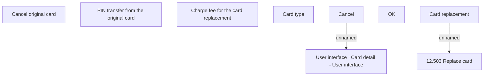

# Card replacement

```mermaid
graph TD
    User_interface_Card_detail_User_interface["User interface : Card detail - User interface"]
    Cancel_original_card["Cancel original card"]
    PIN_transfer_from_the_original_card["PIN transfer from the original card"]
    Charge_fee_for_the_card_replacement["Charge fee for the card replacement"]
    Card_type["Card type"]
    Cancel["Cancel"]
    OK["OK"]
    Card_replacement["Card replacement"]
    n_12_503_Replace_card["12.503 Replace card"]
    Card_replacement -->|unnamed| n_12_503_Replace_card
    Cancel -->|unnamed| User_interface_Card_detail_User_interface
```
