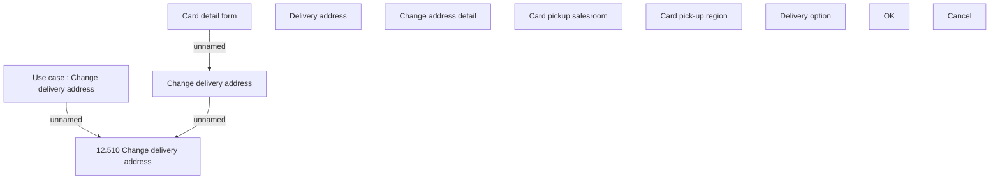

# Change delivery address

```mermaid
graph TD
    Card_detail_form["Card detail form"]
    Delivery_address["Delivery address"]
    Change_address_detail["Change address detail"]
    Card_pickup_salesroom["Card pickup salesroom"]
    Card_pick_up_region["Card pick-up region"]
    Use_case_Change_delivery_address["Use case : Change delivery address"]
    n_12_510_Change_delivery_address["12.510 Change delivery address"]
    Delivery_option["Delivery option"]
    OK["OK"]
    Cancel["Cancel"]
    Change_delivery_address["Change delivery address"]
    Card_detail_form -->|unnamed| Change_delivery_address
    Use_case_Change_delivery_address -->|unnamed| n_12_510_Change_delivery_address
    Change_delivery_address -->|unnamed| n_12_510_Change_delivery_address
```
