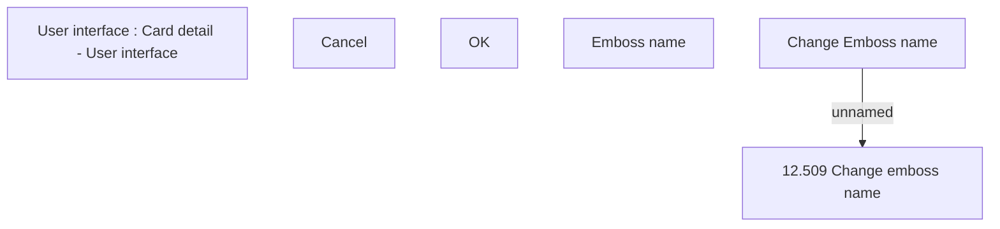

# Change of emboss name

- **Diagram Type**: Custom
- **Package**: HomerSelect/BSL/Analysis Model/Card management support/Card operations/User interface
- **Diagram ID**: 140748
- **Elements**: 6
- **Connectors**: 1

