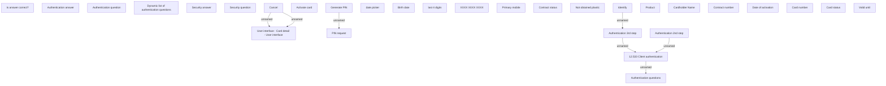

# Client authentication

```mermaid
graph TD
    Authentication_questions["Authentication questions"]
    Is_answer_correct["Is answer correct?"]
    Authentication_answer["Authentication answer"]
    Authentication_question["Authentication question"]
    Dynamic_list_of_authentication_questions["Dynamic list of authentication questions"]
    Is_answer_correct["Is answer correct?"]
    Security_answer["Security answer"]
    Security_question["Security question"]
    User_interface_Card_detail_User_interface["User interface : Card detail - User interface"]
    PIN_request["PIN request"]
    n_12_533_Client_authentication["12.533 Client authentication"]
    Generate_PIN["Generate PIN"]
    Activate_card["Activate card"]
    Cancel["Cancel"]
    date_picker["date picker"]
    Birth_date["Birth date"]
    last_4_digits["last 4 digits"]
    XXXX_XXXX_XXXX["XXXX XXXX XXXX"]
    Primary_mobile["Primary mobile"]
    Contract_status["Contract status"]
    Not_obtained_plastic["Not obtained plastic"]
    Identify["Identify"]
    Cancel["Cancel"]
    Product["Product"]
    Cardholder_Name["Cardholder Name"]
    Contract_number["Contract number"]
    Date_of_activation["Date of activation"]
    Card_number["Card number"]
    Card_status["Card status"]
    Valid_until["Valid until"]
    Authentication_3rd_step["Authentication 3rd step"]
    Authentication_2nd_step["Authentication 2nd step"]
    Identify -->|unnamed| Authentication_3rd_step
    Authentication_3rd_step -->|unnamed| n_12_533_Client_authentication
    Authentication_2nd_step -->|unnamed| n_12_533_Client_authentication
    Generate_PIN -->|unnamed| PIN_request
    Cancel -->|unnamed| User_interface_Card_detail_User_interface
    Cancel -->|unnamed| User_interface_Card_detail_User_interface
    n_12_533_Client_authentication -->|unnamed| Authentication_questions
```
